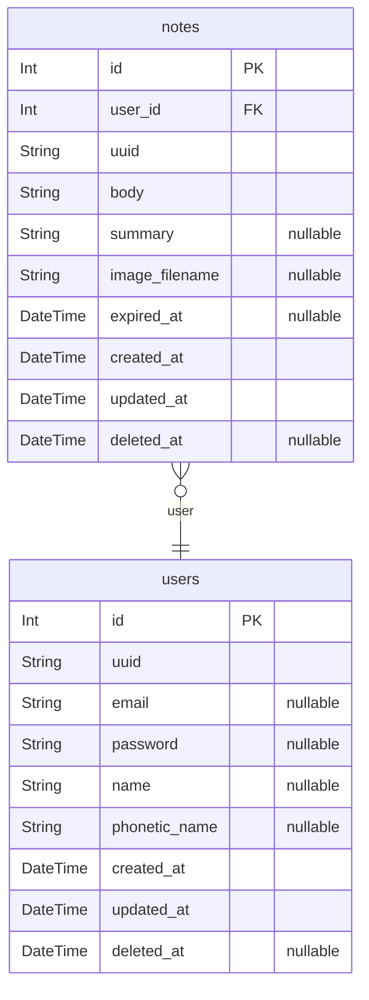
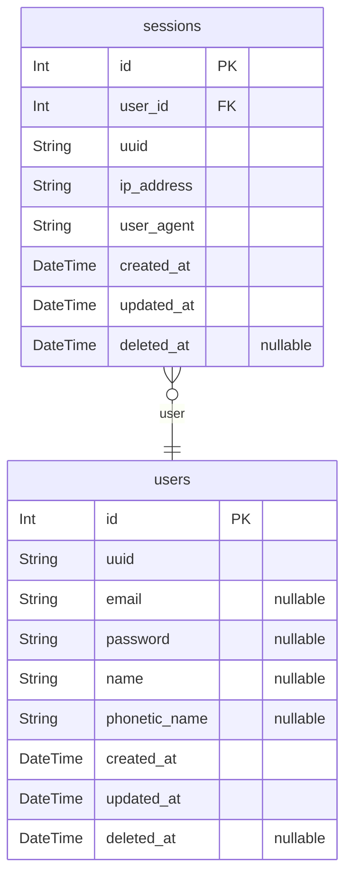

# Schema
> Generated by [`prisma-markdown`](https://github.com/samchon/prisma-markdown)

- [ノート](#ノート)
- [認証](#認証)

## ノート

### `notes`
ノート

**Properties**
  - `id`: 
  - `user_id`: 
  - `uuid`: 表示用識別子
  - `body`: 本文
  - `summary`: 要約
  - `image_filename`: 画像ファイル
  - `expired_at`: 有効期限
  - `created_at`: 
  - `updated_at`: 
  - `deleted_at`: 

### `users`
ユーザー

**Properties**
  - `id`: 
  - `uuid`: 表示用識別子
  - `email`: メールアドレス
  - `password`: パスワード
  - `name`: 名前
  - `phonetic_name`: 名前（読み）
  - `created_at`: 
  - `updated_at`: 
  - `deleted_at`: 

## 認証

### `sessions`
セッション

**Properties**
  - `id`: 
  - `user_id`: 
  - `uuid`: 表示用識別子
  - `ip_address`: IPアドレス
  - `user_agent`: ユーザーエージェント
  - `created_at`: 
  - `updated_at`: 
  - `deleted_at`: 

### `users`
ユーザー

**Properties**
  - `id`: 
  - `uuid`: 表示用識別子
  - `email`: メールアドレス
  - `password`: パスワード
  - `name`: 名前
  - `phonetic_name`: 名前（読み）
  - `created_at`: 
  - `updated_at`: 
  - `deleted_at`: 